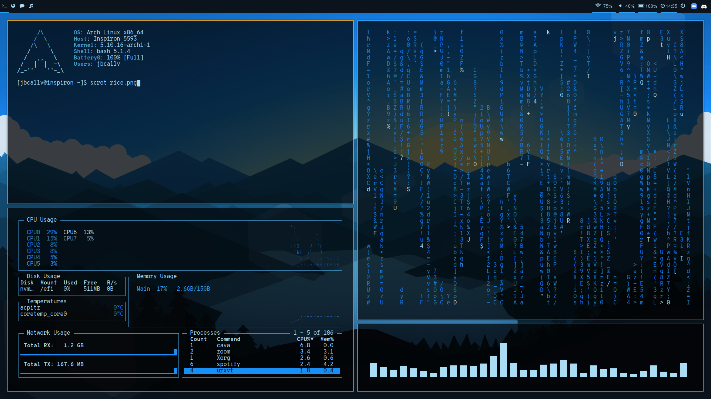

# Dotfiles
Arch Linux dotfiles for muh rice

# Dependencies
<ul> 
  <li>rofi - dmenu replacement</li>
  <li>polybar - statusbar</li>
  <li>feh - image viewer and wallpaper</li>
  <li>GTK-3.0 - for gruvbox theme in GUI apps</li>
  <li>i3-gaps - modified i3-wm to include gaps</li>
  <li>i3-lock - to make lock screen</li>
  <li>neofetch - display system information</li>
  <li>YCM for Vim - autocompletes programming syntax</li>
  <li>neovim - terminal text editor</li>
  <li>rxvt-unicode (urxvt) - terminal</li>
  <li>sshpass - to make scripts for ssh easy</li>
  <li>picom - window compositor that allows for transparency</li>
  <li>htop - shows running processes</li>
  <li>gotop - shows running processes</li>
  <li>ranger - terminal file manager</li>
  <li>font-awesome - polybar icons</li>
  <li>pywal - wallpaper color changing support</li>
</ul>

# Installed Applications
<ul>
  <li>eclipse - IDE</li>
  <li>android Studio - IDE for Android app development</li>
  <li>firefox - browser</li>
  <li>discord-ptb - different version of Discord to fix audio issues</li>
  <li>spotify - music</li>
  <li>cmake - for C++ and C programs</li>
  <li>thunar - GUI file manager</li>
  <li>cmatrix - nice thing to look at</li>
</ul>

# Common Issues
<ul>
  <li>cmatrix not transparent - you have to do the following to install rather than using package manager (taken fron instructions in cmatrix repo):
    <ul>
      <li><pre>git clone https://github.com/abishekvashok/cmatrix.git</pre></li>
      <li><pre>cd cmatrix</pre></li>
      <li><pre>autoreconf -i</pre></li>
      <li><pre>./configure</pre></li>
      <li><pre>make</pre></li>
      <li><pre>make install</pre></li>
    </ul>
  </li>
   
  <li>gotop font issues - make sure you use the .Xresources file in my repo and run <pre>xrdb .Xresource</pre></li>
  <li>urxvt font issues - make sure you use the .Xresources file in my repo and run <pre>xrdb .Xresources</pre></li>
  <li>cava audio issues - go to pavucontrol and set the right input method</li>
</ul>
